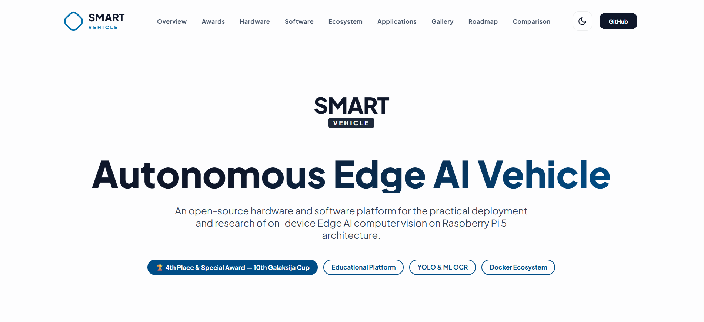
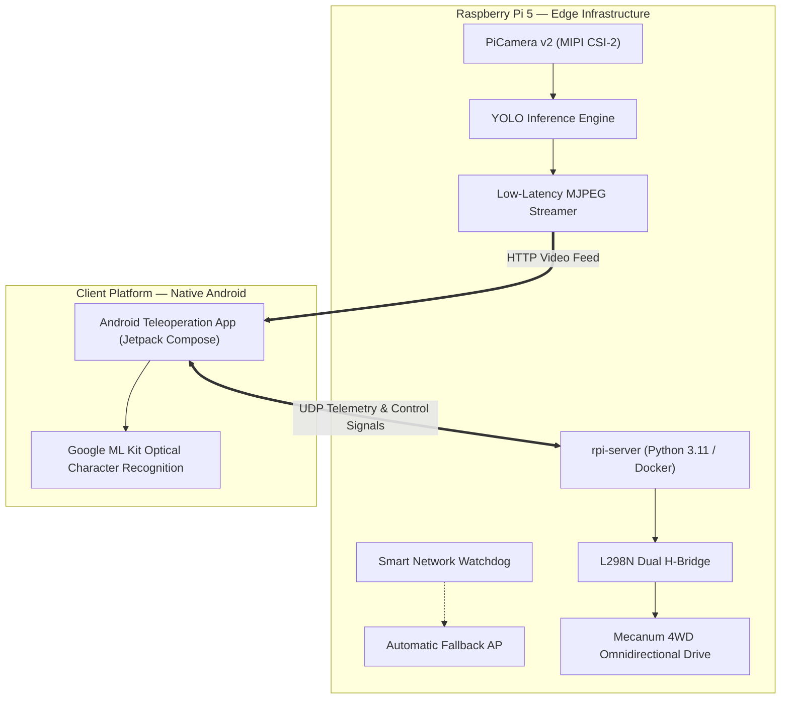
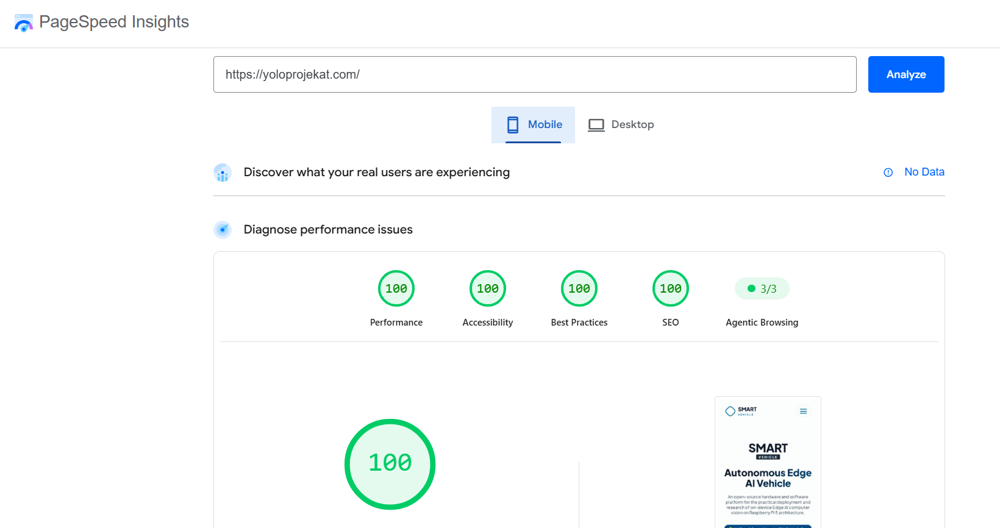
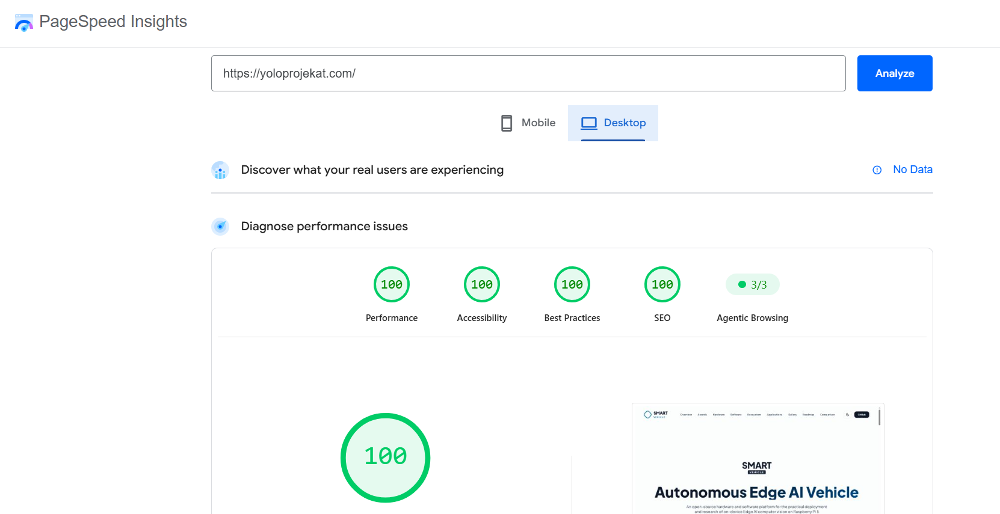

<div align="center">

# 🌐 Smart Vehicle — Autonomous Edge AI Platform

### _Modular Robotics Ecosystem for Real-Time On-Device Computer Vision_

[](https://www.raspberrypi.com/)
[](https://developer.android.com/)
[](https://www.python.org/)
[](https://www.docker.com/)
[](https://github.com/yoloprojekat/model-pipeline)
[](LICENSE)

<br><br>



<br><br>

<p align="center">
  <b>Smart Vehicle (Pametno Vozilo)</b> is a modular, high-performance Edge AI robotics platform powered by the Raspberry Pi 5.
  <br>It features on-device <b>YOLO</b> object detection, low-latency video streaming, self-healing network connectivity, and a dedicated <b>Android</b> client teleoperation suite.
</p>

🏆 **Awarded 4th Place Overall & Special Award for Outstanding Achievement** at the 10th Galaksija Cup National STEM Championship.

</div>

---

## 🏗️ System Architecture



---

## 📦 Ecosystem Repositories

The project codebase is partitioned into specialized repositories for optimal edge maintainability and continuous integration:

### ⚙️ Core & Infrastructure
* **[rpi-server](https://github.com/yoloprojekat/rpi-server):** Primary containerized Python backend. Manages GPIO peripherals, executes **YOLO** real-time object detection inference, and distributes low-latency HTTP MJPEG video streams.
* **[smart-network](https://github.com/yoloprojekat/smart-network):** Self-healing network service ensuring 100% vehicle uptime. Automatically spawns a localized fallback Hotspot whenever external Wi-Fi networks disconnect.
* **[model-pipeline](https://github.com/yoloprojekat/model-pipeline):** Optimization and quantization pipeline (INT8/FP16) converting YOLO models to TFLite and ONNX formats for hardware-accelerated edge inference.

### 📱 Client Platform
* **[android-client](https://github.com/yoloprojekat/android-client):** The official teleoperation and monitoring station built exclusively for the **Android platform** using Jetpack Compose and Kotlin. Delivers real-time holonomic touch control, live telemetry HUD, low-latency FPV video streaming, and on-device **Google ML Kit OCR** for roadway sign reading.

<details>
<summary><b>🏛️ Archived Modules & Prototypes</b></summary>
<br>

* **[rpi-server-legacy](https://github.com/yoloprojekat/rpi-server-legacy):** Early monolithic backend prototype based on Linux Systemd daemons.
* **[landing-page-legacy](https://github.com/yoloprojekat/landing-page-legacy):** Predecessor landing page built on the Svelte framework.

</details>

---

## 🛠️ Technical Specifications

### Hardware Platform
| Component | Specification | Function |
| :--- | :--- | :--- |
| **SBC** | Raspberry Pi 5 (8GB LPDDR4X) | Central compute unit for vision inference & hardware control |
| **Vision Sensor** | Raspberry Pi Camera Module v2 (8MP, Sony IMX219) | 30 FPS MIPI CSI-2 video acquisition |
| **Drivetrain** | 4× DC Geared Motors with Mecanum Wheels | Full holonomic (omnidirectional) locomotion |
| **Motor Driver** | L298N Dual H-Bridge Controller | Independent PWM direction and speed regulation |
| **Power Management** | XL4015 Step-down DC-DC Buck Converter (5.1V, 5A) | Regulated, low-noise power delivery under peak CPU workloads |

### Software & AI Stack
| Layer | Technologies |
| :--- | :--- |
| **Edge AI & Vision** | **YOLO**, Google ML Kit OCR, ONNX Runtime, TensorFlow Lite, OpenCV |
| **Edge Backend** | Python 3.11, Docker & Docker Compose, FastAPI, Asyncio, UDP/TCP Sockets |
| **Client Platform** | Native **Android Platform** (Android 15+ SDK, Kotlin, Jetpack Compose, Coroutines) |
| **Web Presentation** | Semantic HTML5, Vanilla CSS, Vanilla JavaScript (Zero Dependencies) |

---

## ⚡ Core Web Vitals & Performance

The web presentation layer is built from the ground up for maximum speed, zero runtime overhead, and optimal SEO, scoring a perfect **100/100/100/100** across all Google PageSpeed Insights & Lighthouse audits:

| 📱 Mobile Web Vitals (100 / 100 / 100 / 100) | 🖥️ Desktop Web Vitals (100 / 100 / 100 / 100) |
| :---: | :---: |
|  |  |

---

## 🚀 Quick Start Guide

### 1. Android Client Setup
1. Clone the [android-client](https://github.com/yoloprojekat/android-client) repository.
2. Open the project in **Android Studio** (Android 15 SDK / Ladybug+ recommended).
3. Connect your Android device via USB debugging and deploy the application (`Run > Run 'app'`).

### 2. Edge Server Deployment (Raspberry Pi 5)
1. SSH into your Raspberry Pi 5.
2. Clone [rpi-server](https://github.com/yoloprojekat/rpi-server):
   ```bash
   git clone https://github.com/yoloprojekat/rpi-server.git
   cd rpi-server
   docker compose up -d
   ```
3. The server will initialize video streaming and listen for Android client commands.

### 3. Web Presentation Layer (Landing Page)
1. Clone this repository:
   ```bash
   git clone https://github.com/yoloprojekat/landing-page.git
   ```
2. Open `index.html` directly in any modern browser (zero build steps, zero dependencies).

---

## 🏆 Awards & Competition Recognition

- **4th Place Overall**: 10th Galaksija Cup National STEM Championship.
- **Special Award for Outstanding Achievement**: Conferred by the Association of Electrical Engineering Schools of Serbia (ZETŠS) and the Nordeus Foundation for innovative Edge AI engineering, real-time inference latency, and microservice containerization.

---

<div align="center">

**Author:** Danilo Stoletović  
**Mentor:** Predrag Šubarević • **Former Mentor:** Dejan Batanjac  
**ETŠ „Nikola Tesla“ Niš • 2026**

</div>